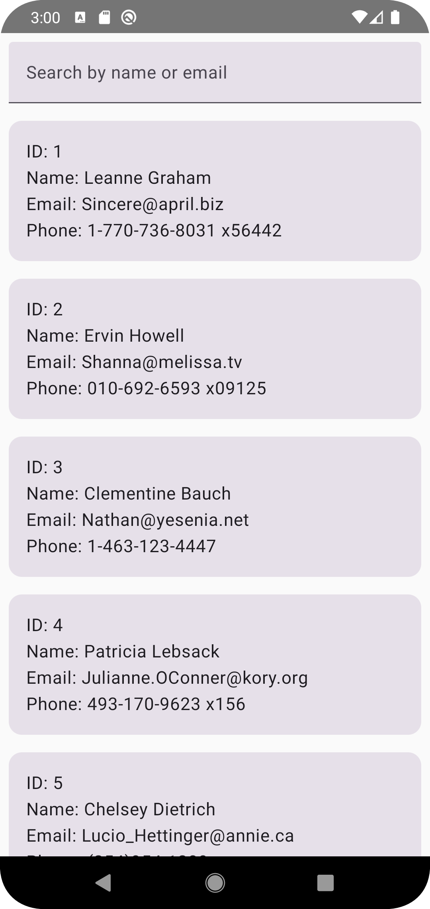
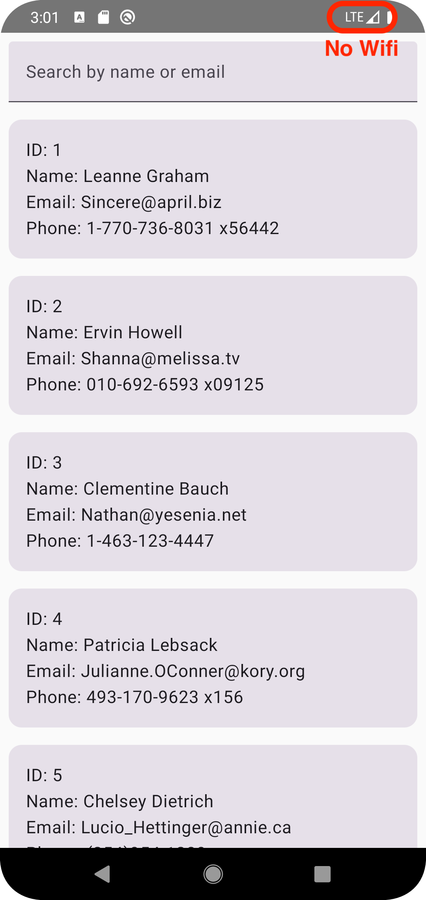
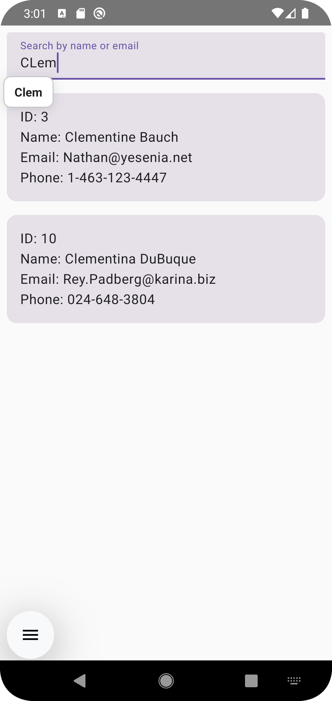

# User Directory App

A simple Android application that displays a list of users from a public API, with offline support.

## Overview

This app fetches user data from the JSONPlaceholder API, stores it locally in a Room database, and displays it in a clean, scrollable list. It's designed with an offline-first architecture, meaning you can still view the cached user data even without an internet connection. The app also includes a search feature to filter users by name or email.

## Screenshots

*(Add your screenshots here)*

| User List (Online) | User List (Offline) | Search |
| :---: |:---:|:---:|
|  |  |  |

## Core Functionalities

-   **Offline-First:** The app uses a `UserRepository` as a single source of truth, which first loads data from the local Room database and then fetches fresh data from the Retrofit API to keep the local cache updated.
-   **Search:** Search functionality is implemented by querying the Room database directly using a `LIKE` clause in the `UserDao`, ensuring fast, local-only searches without extra API calls.
